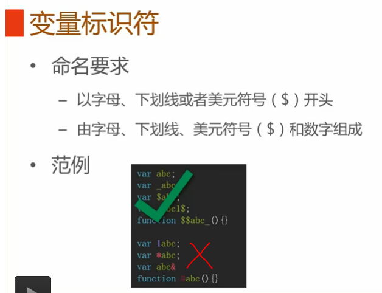
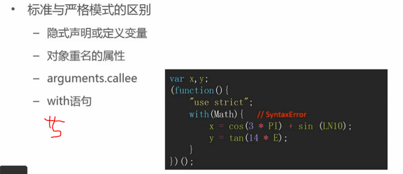
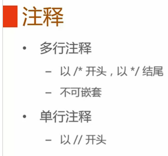

# 基本语法（词法重点）
* [变量标识符]()
* [关键字和保留字]()
* [大小写敏感]()
* [严格模式]()
* [注释]()
### 变量标识符

### 关键字和保留字

### 大小写敏感
 
Note: 对变量、关键字、保留字等均敏感，所以图中Arr,For均失效。
### 严格模式
 

Note: 上图列举在"use strict";模式下SyntaxError。
### 注释

