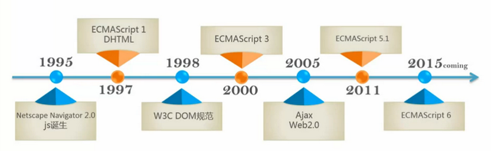
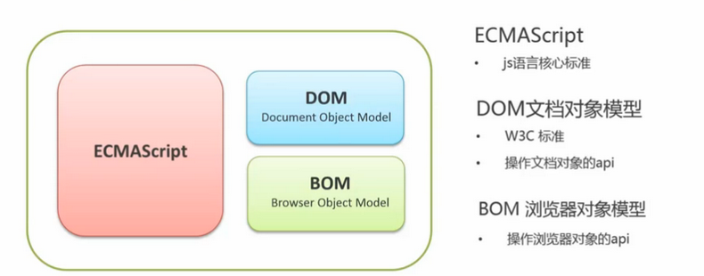
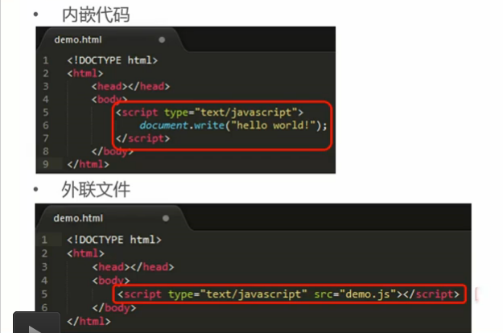

# js介绍
* [js历史]()
* [浏览器中的js]()
* [js引入]()
### js历史
 
　　javascript是sun公司授权给Netscape的名称，但是没有授权给欧洲计算机制造商协会，Netscape将js1.1语言规范提交给欧洲计算机制造商协会ECMA,ECMA以此为基础发布了ECMAScript1语言规范。 
　　DHTML各公司为自己浏览器开发的技术，允许网页开发者使用js动态的修改网页结构内容，被认为是后来DOM标准的原型。
### 浏览器中的js
 
### js引入
 
尽量在**靠近body结束部**引入**js代码段**或者**js文件** 
NOTE: type属性最好写上
