# 标准类型
* 原始类型、引用类型<br />
```
/*
BEGIN   FOR EACH
    类型说明
    出现场景
    类型转换
END
*/
```
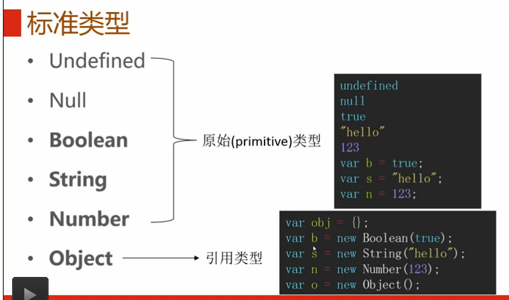<br />
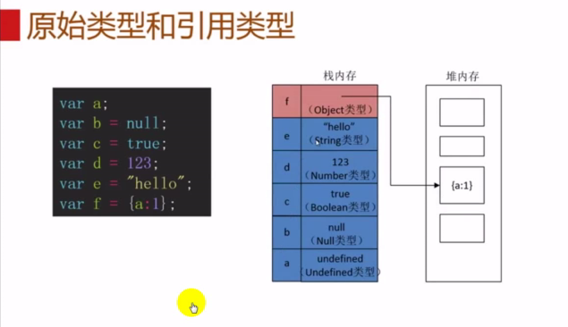<br />
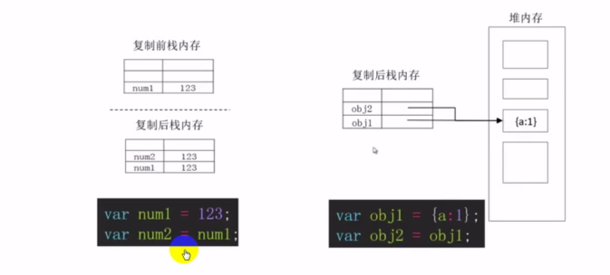<br />
<br />
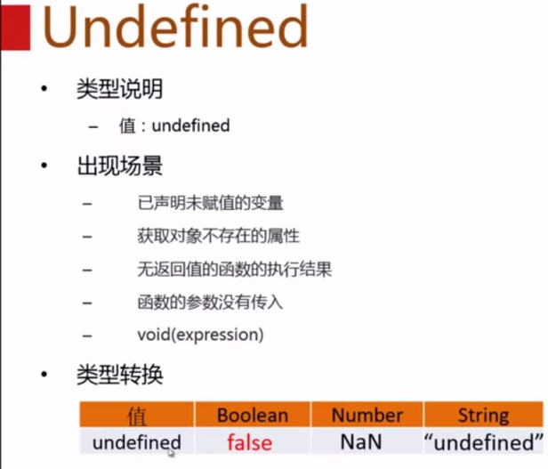<br /><br />
Note: <br />
**出现场景:**<br />
* 已声明未赋值的变量：a显示声明后未赋值   b隐式声明后未赋值<br />
<br />
* 获取对象不存在的属性<br />
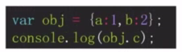
* 无返回值的函数的执行结果<br />

* 函数未传入的参数<br />
<br />
**案例：**
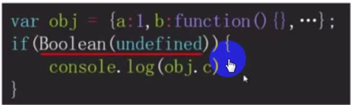<br />
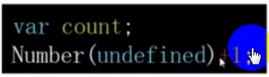<br />
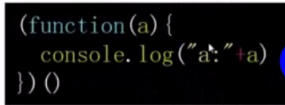<br />
<br />
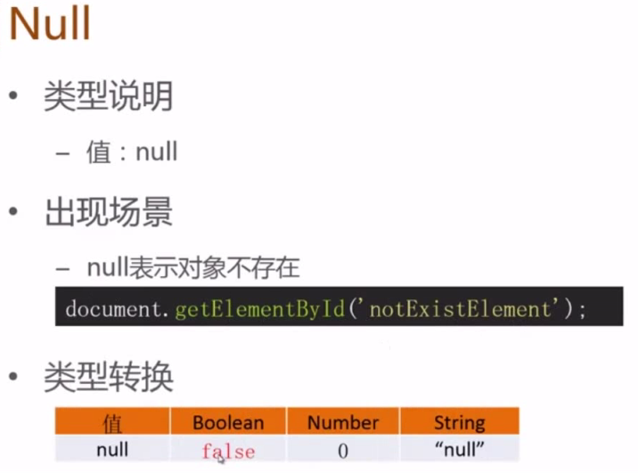<br />
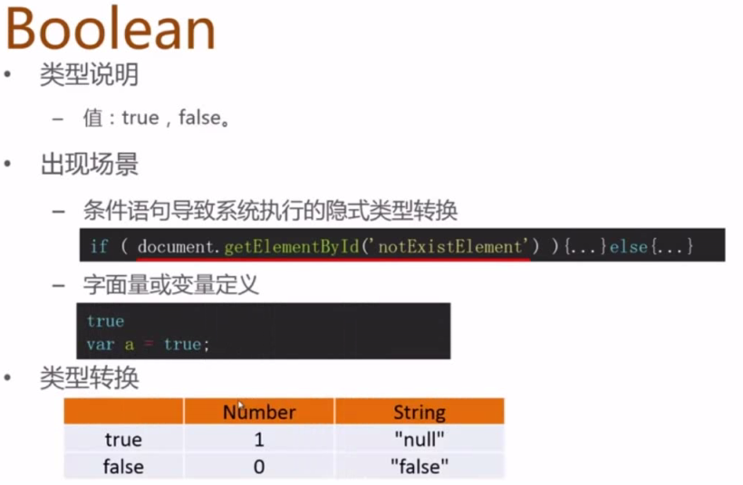<br />
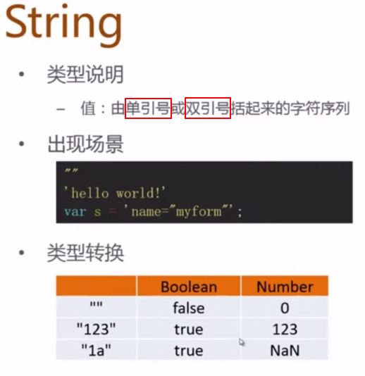<br />
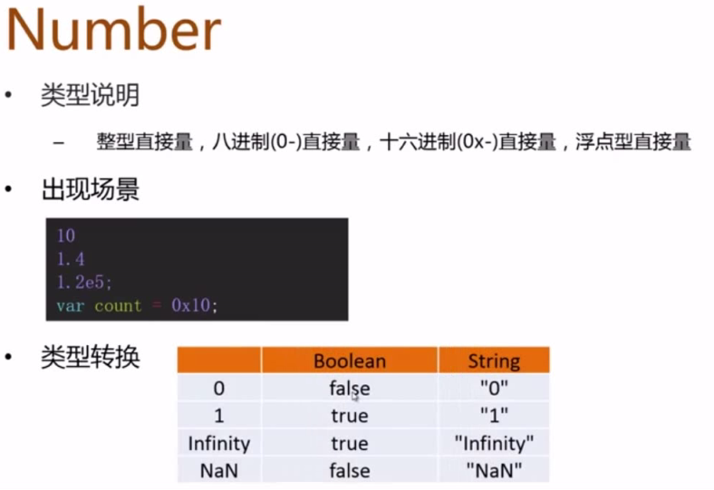<br />
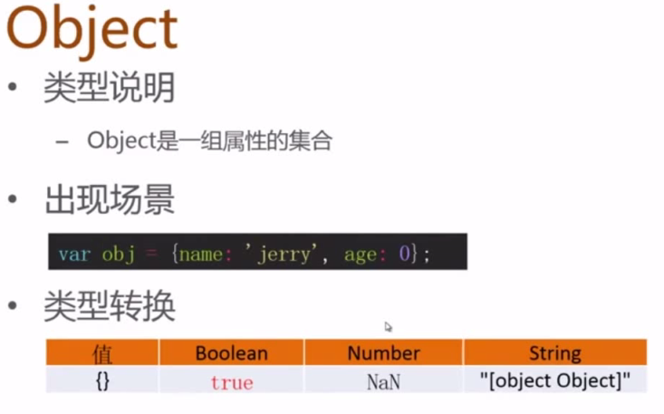<br />
<br />
**类型转换总结**<br />

| type | Value | Boolean | Number | String |
| -- | -- | -- | -- | -- |
| **Undefined** | undefined | false | **NaN** | "undefined" |
| **Null** | null | false | 0 | "null" |
| **Boolean** | true |  | 1 | **"null"** |
|  | true |  | 0 | "false" |
| **String** | "" | false | 0 |  |
|  | "123" | true | 123 |  |
|  | "1a" | true | **NaN** |  |
| **Number** | 0 | false |  | "0" |
|  | 1 | true |  | "1" |
|  | -1 | true |  | "-1" |
|  | Infinity | true |  | "Infinity" |
|  | NaN | **false** |  | **"NaN"** |
| **Object** | {} | **true** | **NaN** | **"[object Object]"** |

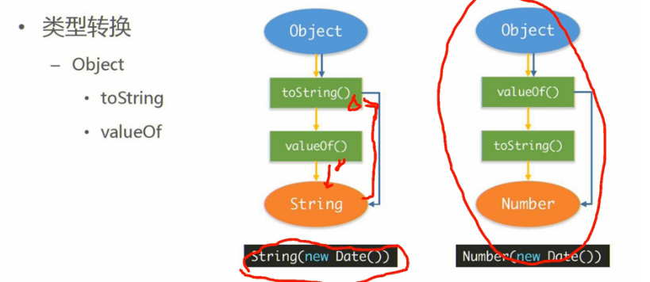<br />
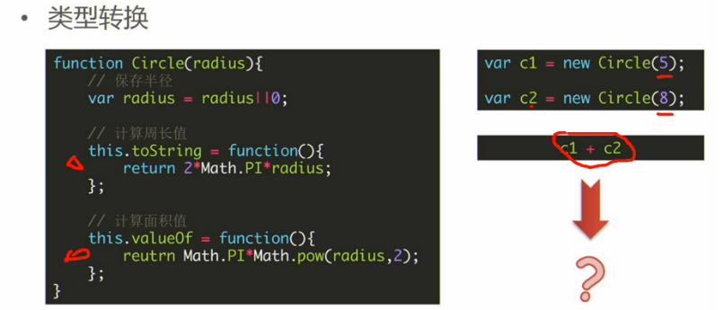<br />
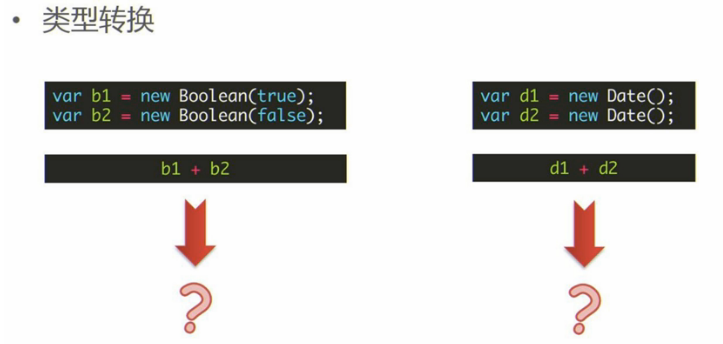<br />
