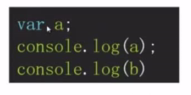
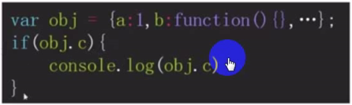
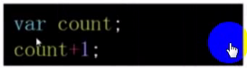
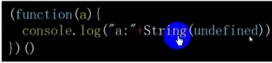

# 标准类型
* 原始类型、引用类型<br />
```
/*
BEGIN   FOR EACH
    类型说明
    出现场景
    类型转换
END
*/
```
<br />
<br />
<br />
<br />
<br /><br />
Note: <br />
**出现场景:**<br />
* 已声明未赋值的变量：a显示声明后未赋值   b隐式声明后未赋值<br />
<br />
* 获取对象不存在的属性<br />

* 无返回值的函数的执行结果<br />

* 函数未传入的参数<br />
<br />
**案例：**
<br />
<br />
<br />
<br />
<br />
<br />
<br />
<br />
<br />